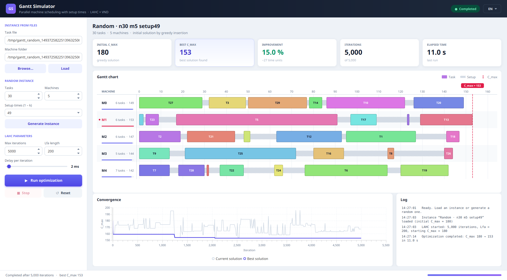

# Supply Chain Optimisation — Parallel Machine Scheduling with Setup Times

A Java project that schedules jobs on **unrelated parallel machines with sequence-dependent setup times**, minimising the **makespan (C_max)**.
It combines a **Late Acceptance Hill Climbing (LAHC)** metaheuristic with a **Variable Neighborhood Descent (VND)**. It also ships with **Gantt Simulator**, a JavaFX desktop app that shows the optimisation as it runs.



---

## Table of contents

- [The problem](#the-problem)
- [The algorithm](#the-algorithm)
- [Quick start](#quick-start)
- [Gantt Simulator (GUI)](#gantt-simulator-gui)
- [Command-line solver](#command-line-solver)
- [Instance format](#instance-format)
- [Project structure](#project-structure)
- [Manual build](#manual-build)
- [Authors](#authors)

---

## The problem

- There are **n jobs** and **m machines**. Every job must run exactly once, on one machine.
- A job's **processing time depends on the machine** it runs on.
- When a machine switches from job *i* to job *j*, it needs a **setup time** that depends on the machine and on the pair *(i, j)*. There is no setup before a machine's first job.
- A machine's **completion time** is the sum of its processing and setup times:

  ```
  C_k = Σ p(job, k) + Σ s_k(previous job, next job)
  ```

- The goal is to minimise the latest completion time over all machines:

  ```
  C_max = max_k C_k
  ```

## The algorithm

### Initial solution: greedy insertion
Jobs are taken in index order. Each job is tried at every position on every machine, then inserted where it gives the **smallest completion time** for that machine.

### Late Acceptance Hill Climbing (LAHC)
LAHC is a local search that sometimes accepts a worse solution, which helps it escape local optima. It keeps a history of the last `Lfa` objective values.

At iteration *i*, a candidate solution is built by running VND on the current solution. The candidate is **accepted** if its C_max is:
- no worse than the current solution's C_max, **or**
- no worse than the value recorded `Lfa` iterations earlier (`history[i mod Lfa]`).

The best solution seen so far is always kept.

### Variable Neighborhood Descent (VND)
VND explores five neighborhoods in turn. Most of them act on the **critical machine**, the one whose completion time equals C_max:

| # | Neighborhood | Move |
|---|---|---|
| 1 | Internal swap | Best swap of two jobs on the critical machine |
| 2 | Inter-machine reinsertion | Every job is removed, then greedily reinserted at its best machine and position |
| 3 | External insertion | Best job to move from the critical machine to a random other machine |
| 4 | External swap | Best exchange of jobs between the critical machine and a random other machine |
| 5 | Balancing | Moves jobs from the most loaded machine to the least loaded one |

Whenever a neighborhood improves the solution, VND starts again from the first neighborhood. To add diversification, VND returns early with a 10% probability at each step.

---

## Quick start

The start scripts do everything for you, with **no administrator rights** needed:
1. Look for Java 17 or later. If none is found, download Eclipse Temurin 17 into `.runtime/`.
2. Download the JavaFX 17.0.17 SDK into `lib/` if it is not there.
3. Compile the sources.
4. Launch Gantt Simulator.

The downloads (~190 MB for Java, ~40 MB for JavaFX) only happen on the first run.

**Windows**: double-click `start\start.bat`, or run:
```bat
start\start.bat
```

**Linux / macOS**
```bash
./start/start.sh
```

> Supported platforms: Windows x64, Linux x64, macOS (Intel and Apple Silicon).
> JavaFX 17.0.17 is not published for Linux ARM.

---

## Gantt Simulator (GUI)

### Loading an instance
- **Instance from files**: enter the path to `task.txt` and to the `machine/` folder, or click **Browse…** and pick an instance folder.
- **Random instance**: choose the number of jobs, the number of machines and the setup time range (`1–9`, `1–49`, `1–99` or `1–124`), then click **Generate instance**.

### Running the optimisation
| Parameter | Description |
|---|---|
| Max iterations | Number of LAHC iterations |
| Lfa length | Size of the late-acceptance history |
| Delay per iteration | Slows the search down so you can watch it (can be changed while it runs) |

- **Run optimization** starts the search on a background thread, so the window stays responsive.
- **Stop** interrupts the search and keeps the best solution found so far.
- **Reset** goes back to the initial greedy solution.

### What you see
- **Key indicators**: initial C_max, best C_max, improvement in %, iterations and elapsed time.
- **Gantt chart** on a real time scale:
  - coloured blocks for jobs and hatched blocks for setup times;
  - a dashed line at C_max, with the critical machine highlighted in red;
  - a load bar for each machine;
  - hovering a job highlights it and shows its start, duration and end.
- **Convergence chart**: C_max of the current and best solutions over the iterations.
- **Log** of loads, runs and errors, and a **status bar** with progress.

### Languages
The interface is available in **English** and **French**. Use the language menu (`EN ▾` / `FR ▾`) at the top right. The change applies instantly, including number formats, and your choice is remembered.

---

## Command-line solver

`Main` runs LAHC on a single instance, with `maxIterations = 50000` and `Lfa = 1000`, then prints the results:

```bash
javac Data.java Machine.java Solution.java Main.java
java Main Instances/small_n6_m2_setup9_rep1
```

```
Instance: Instances/small_n6_m2_setup9_rep1
C_max initial: 144
C_max final: 126
LFa: 1000, maxIterations: 50000
Temps d'exécution: 236 ms
```

Each run also appends a row to `results.csv`:

```
Instance,Cmax_initial,Cmax_final,LFa,itermax,Temps_execution(ms)
```

### Batch runs
`instances.bash` compiles the solver and runs every small instance found in `Instances/small_n{6,8,10,12}_m{2,3,4,5}_setup{9,49,99,124}_rep{1..10}`, with up to 7 runs in parallel:

```bash
./instances.bash
```

> The `Instances/` folder is not included in the repository. Put your instance folders there before running the batch script.

---

## Instance format

Each instance is a folder:

```
my_instance/
├── task.txt
└── machine/
    ├── machine_0.txt
    ├── machine_1.txt
    └── ...
```

**`task.txt`**: the first line gives `n m`. It is followed by an `n × m` matrix where row *i*, column *k* is the processing time of job *i* on machine *k*.

```
6 2
18 73
98 9
...
```

**`machine/machine_k.txt`**: an `n × n` matrix, with no header line. Row *i*, column *j* is the setup time on machine *k* when job *j* follows job *i*.

```
3 7 1 9 4 2
...
```

The reference benchmark (see `note.pdf`) uses random values drawn from `{1–9}`, `{1–49}`, `{1–99}` and `{1–124}`:
- **small** instances: 6–12 jobs on 2–5 machines;
- **large** instances: 25–200 jobs on 10–30 machines;
- 10 replicates per configuration.

---

## Project structure

| File | Role |
|---|---|
| `Data.java` | Reads `task.txt` and the setup matrices |
| `Machine.java` | A machine: its ordered job sequence, completion time, and best-position insertion and removal |
| `Solution.java` | A full schedule: greedy construction, the neighborhoods and VND |
| `Main.java` | LAHC command-line solver, writes `results.csv` |
| `GanttSimulator.java` | JavaFX GUI: controls, live LAHC, Gantt and convergence charts |
| `I18n.java` | English and French translations of the GUI |
| `gantt.css` | GUI theme |
| `start/` | One-click start scripts (`start.bat` + `start.ps1` for Windows, `start.sh` for Linux/macOS) |
| `instances.bash` | Batch runner for the benchmark instances |
| `note.pdf` | Project report (in French): instances, code organisation, results |

---

## Manual build

You need **JDK 17+** and the **JavaFX 17 SDK** ([download](https://gluonhq.com/products/javafx/)).

```bash
FX=path/to/javafx-sdk-17.0.17/lib

javac -encoding UTF-8 --module-path "$FX" --add-modules javafx.controls *.java
java --module-path "$FX" --add-modules javafx.controls GanttSimulator
```

The command-line solver (`Main`) does not need JavaFX.

---

## Authors

- Gaëtan Houllier
- Matteo Quintaneiro
